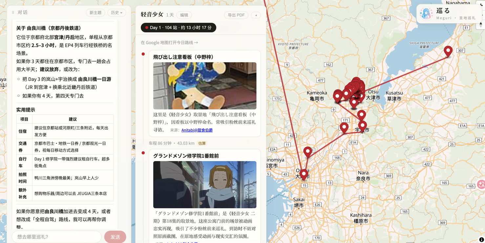

# Meguri（巡る）

对话式动画圣地巡礼规划 Agent。你用中文说"我想去《轻音少女》的京都巡礼，三天"，系统检索真实圣地数据（anitabi.cn），规划出按天组织、带真实交通和每站讲解的行程，画在地图上。

**核心设计哲学**：LLM 只做它不可替代的事——理解用户意图和写文案；所有可验证的事实（地点、距离、时刻）都走确定性代码和真实数据源，LLM 碰不到。

## 功能展示

以轻音少女为例——输入"我想去轻音少女的京都巡礼，三天"：



- 第一季、第二季的 124 处圣地**合并规划**成一个行程（每站保留出处作品标记）
- 剧场版的 51 处在欧洲，被"京都"过滤后**在回复正文中如实告知**（"本次未包含，以后可单独规划"），不静默丢弃
- 地图上按天上色的标点 + 每天的路线；行程面板里每站带对照截图、到达时刻、讲解和来源署名（可点击，CC BY-NC-SA 要求）
- 行程支持编辑（增删站点/换序/换天），编辑后自动重校验交通和时刻
- 可导出 PDF；每天路线可一键在 Google 地图打开

## 快速开始（一键部署）

前提：Docker（compose）。**需要一个 OpenAI 兼容的 LLM API key**（默认配的是 kimi）：

```bash
cp .env.example .env.local   # 编辑，填入 MEGURI_OPENAI_API_KEY
./start.sh                   # 构建并启动 db + backend + web（OTP 可选，见下）
```

访问 http://localhost:8080 （web = nginx 静态前端 + `/api` 反代到后端）。

首次启动后灌一次作品目录（作品名解析的数据源，19144 条 Bangumi 动画索引）：

```bash
docker compose exec backend python -m app.rag.ingest_works
```

没有 key 时系统也能启动，但对话会在调用 LLM 时明确报"模型服务暂时不可用"。

## 原理

### 一次 Agent Loop 怎么走

自研最小 ReAct 循环（刻意不引入 Agent 框架，控制流全透明），代码在 `backend/app/agents/orchestrator.py`：

1. 用户消息先落库（`messages` 表），SSE 推 `received`
2. 组装上下文：system prompt（角色 + 动态工具清单 + 线格式约定）+ 该会话全量历史
3. 调 LLM（LangChain 网关，90s 超时，连接错误重试 2 次）。输出按首字符分类：`{` 开头 = 工具调用（缓冲不上屏），否则 = 最终回复（逐段 SSE 流式上屏）
4. 工具调用 → 执行 → 观察结果以 `[工具观察结果]` 前缀回灌 messages，进入下一轮；最多 5 轮兜底
5. 最终回复落库（assistant 消息 + 结构化 payload），行程快照追加到 `itineraries` 表，SSE 推 `done`

### 两个工具的输入输出

模型只有两把工具，参数和产出都是约定好的线格式：

**search_seichi（Scout：圣地检索）**

输入（模型输出的 tool_call）：

```json
{"type": "tool_call", "name": "search_seichi",
 "args": {"ani_name": "轻音少女", "area": "京都"}}
```

输出（给模型的观察值，同时也是给前端的结构化 payload）：

```json
{
  "candidates": [{"id": "abc123", "name": "豊郷小学校旧校舎群", "work": "轻音少女",
                  "area": "滋賀県", "lat": 35.20, "lng": 136.22,
                  "image": "https://...", "ep": 4, "ep_seconds": 812,
                  "origin": "Anitabi@卜卜口", "origin_url": "https://anitabi.cn/"}],
  "by_work": {"轻音少女": 48, "轻音少女 第二季": 76},
  "out_of_area": [{"work": "轻音少女 剧场版", "city": "欧洲", "count": 51}],
  "note": "out_of_area 里的作品在本次地区之外有巡礼点，请在回复中告知用户"
}
```

内部链路：`ani_name` → `anime_works` 表解析 subjectID（子串精确匹配优先，pg_trgm 相似度兜底错字，多作品命中全返回）→ 逐作品实时调 anitabi 取地标（故障按作品回退本地离线包并显式提示）→ 地区过滤 + 合并。

**plan_itinerary（Planner 全家桶：检索 → 聚类 → 交通 → 讲解）**

输入：

```json
{"type": "tool_call", "name": "plan_itinerary",
 "args": {"ani_name": "轻音少女", "area": "京都", "days": 3}}
```

输出（行程快照，落 `itineraries` 表 + 随响应返回前端）：

```json
{
  "work": "轻音少女", "area": "京都", "day_count": 3,
  "days": [{
    "day": 1,
    "seichi": [{"id": "abc123", "name": "...", "lat": 35.01, "lng": 135.76, "work": "轻音少女"}],
    "legs": [{"from_id": "abc123", "to_id": "def456", "mode": "transit",
              "duration_minutes": 22, "estimate": false, "degraded": false}],
    "checks": [{"seichi_id": "abc123", "arrive_time": "09:00"}],
    "narrations": [{"seichi_id": "abc123", "text": "《轻音少女》取景地「…」，出自第 4 集…",
                    "citation": {"source": "Anitabi@卜卜口", "url": "https://anitabi.cn/"}}]
  }]
}
```

内部管线（纯确定性，LLM 碰不到事实）：k-means 地理聚类切天 → 天内最近邻排序 → OTP 真实交通替换估算段（挂了显式降级不报错）→ 09:00 起每站 45 分钟推算时刻 → 站点元数据生成讲解。

### 故障语义（三级显式区分）

anitabi 故障且有离线包 → 降级离线数据包 + 提示"可能不是最新"；故障且无包 → 503"圣地数据服务暂时不可用"；成功但该作品无数据 → 200 + "这部作品没有圣地巡礼数据"。可以降级，但绝不静默冒充实时数据。

### 评测（eval/，不进 CI 门禁）

golden 数据集（`eval/datasets/*.jsonl`）+ 确定性规则判卷（`RuleJudge`），显式运行：

```bash
.venv/bin/python -m pytest eval/ -v -s   # 需要 5433 的 Postgres（compose db）
```

机制：每个 case 用假外部世界（脚本化 LLM + 内存假数据）驱动**完整真管线**（HTTP → ReAct 循环 → 工具 → 落库），对照标准答案打分。维度：Scout 检索命中率 / Planner 四规则（天数正确、每天非空、全覆盖、最近邻优于随机基线）/ Navigator 时间可行性（时刻单调）/ Storyteller 讲解接地（含站名、署名与站点 origin 一致）/ e2e 六项清单（含 trace 可观测性）/ work_resolve 作品名解析 8 例（打真实 PG 的 anime_works 表，标定 pg_trgm 阈值用）。数据集每例带 `rationale` 说明期望的独立依据；`eval/test_meta.py` 还测判卷规则自身（防"永远通过"的假把式）。

诚实边界：真 LLM judge（生成内容事实性校验）是 stub；LLM 的工具决策质量（真实模型表现）不在评测范围。

## 本地开发

LLM 配置（真实模型）：把 key 写进仓库根的 `.env.local`（已 gitignore，勿提交）：

```bash
MEGURI_OPENAI_API_KEY=...
MEGURI_OPENAI_BASE_URL=https://api.kimi.com/coding/v1
MEGURI_OPENAI_MODEL=kimi-for-coding
```

后端（Python 3.11+）：

```bash
python3.11 -m venv .venv
.venv/bin/pip install -r backend/requirements-dev.txt
cd backend && ../.venv/bin/python -m pytest   # 行为测试经 FastAPI TestClient（HTTP 缝）
.venv/bin/uvicorn app.main:app --reload --app-dir backend
```

注意：圣地数据源默认 `seichi_mode=live`，裸跑 dev 会访问外部网络（api.anitabi.cn）；要完全离线可设 `MEGURI_SEICHI_MODE=file`（本地数据包；测试环境默认即 file）。

**数据层架构**：
- **作品 ID 空间来自 Bangumi 全量索引**：`python -m app.ingest_bangumi` 用 Bangumi v0 API（自定义 UA、限速 ≤2 req/s、按年 checkpoint 断点续传）拉 1990 年后全部动画 → `data/works/anime-1990plus.json`（Git 里的源 artifact）；再经 `python -m app.rag.ingest_works` 幂等 upsert 进 **anime_works 表**（DB 是运行时的服务层，JSON 可重建）
- **区域过滤即显式排除**：被地区过滤整部作品滤掉的进 `out_of_area`，由模型在回复正文里告知用户，不弹 toast、不静默丢弃

交通：走本地 OTP（`MEGURI_OTP_BASE_URL` 指向服务）；OTP 未启动时 Navigator 自动降级为估算段（leg 带"降级"标记），不会报错。

## OTP 交通图（宇治/京都）

一次性构建 routing graph（幂等，可重复执行）：

```bash
otp/download.sh   # 下载 kansai OSM → osmium 裁剪京都/宇治 → otp/data/Kyoto.osm.pbf
otp/build.sh      # docker 构建 graph.obj 并校验（吃内存，docker VM 建议 ≥ 6GB）
docker compose up -d otp   # 起 OTP 服务（:8081）
```

GTFS（公共交通换乘/时刻表）：京都市営バス/地下鉄的 GTFS-JP 只发布在公共交通オープンデータセンター（ODPT），需免费注册拿 consumerKey（见 `otp/download.sh` 头部注释），把 zip 放进 `otp/data/` 后 `otp/build.sh --force` 重建即可。没有 GTFS 时 graph 只含路网：步行/车程为真实 OSM 路网耗时，换乘查询返回"未覆盖"降级。已知覆盖缺口：宇治的 JR 奈良线、京阪宇治线（无公开 GTFS）及京都市营巴士/地铁（需注册）。

## 讲解（Storyteller，语料库已下线）

早期版本有 RAG 语料库（`corpus_chunks` 表 + pgvector/pg_trgm 混合检索），后来发现是空转：anitabi 地标没有自由文本字段，语料是把 planner 已有的站点元数据拼成句子绕一圈再检索回来，不产生新信息——已删除（表、embedding 依赖、灌库脚本一并退役）。

现在的讲解直接由**站点自带元数据**（作品名/站名/出处集数/截图秒数）生成：无 LLM 时模板拼句，有 LLM 时生成 ≤100 字讲解（只许用给定元数据，失败回退模板）；citation 是 anitabi 截图来源署名（origin/origin_url，CC BY-NC-SA 本来就要求标注）。

前端（Node 22+）：

```bash
cd frontend
npm install
npm run dev          # vite dev server，/api 代理到 localhost:8000
npm run type-check   # vue-tsc
```

领域术语见 `CONTEXT.md`。
